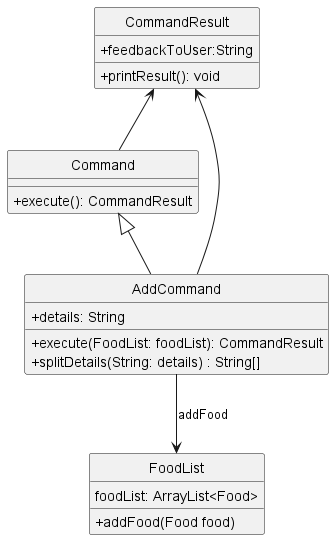
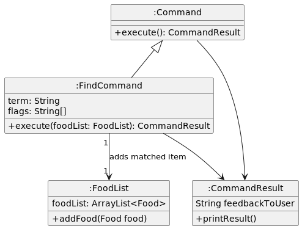
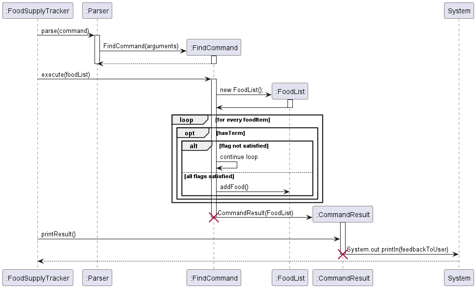

# Developer Guide

## Design

{To Be Added}

---

## implementation

### Add feature

The add feature is implemented using a `AddCommand` class extending from `Command` Class. 
`AddCommand` contains an `execute` methods, which utilises the internal `spiltDetails` methods to extract the food details
and to construct new `food` object .
It is also facilitated by `Foodlist` Class, using `addFood` method of `FoodList` Class.

The add feature implementation is as follows:
1. New AddCommand object is created by passing in a String containing food details
2. `splitDetails` is called to split the string
3. boolean `hasQuantity` is used to record whether the string contains `-q` quantity flag
4. Split the string using ` -q ` regardless of whether the string contains the quantity part
5. Check the index of `-n` and `-e` and split the string to save the details of the food name and expiry date
6. If `hasQuantity` is `true`, return a String array with `name`, `date` and `quantity`, else only return
a String array with `name` and `date`.
7. Create a new `Food` object and use `addFood` to add the new food into the food list
8. Return a `CommandResult` to show the successful message to the user

**Class Diagram**

**Sequence Diagram**

### Find feature
The find command is implemented using a `FindCommand` class which
utilizes `findFood` method of the FoodList.

The `findFood` method implementation is as follows:
1. Initialize `FoodList` result variable
2. Start a loop iterating over each foodItem 
3. Do word processing on a term and check if the foodItem name includes it
4. Enter a loop with switch statement for each component of the `flags` argument 
5. If some flag is not satisfied, continue the loop without adding foodItem to the result
6. If the flags loop is over, the flags conditions were satisfied, so add the foodItem to the result

**Class Diagram** 

**Sequence Diagram**

### Help feature
The help command is implemented using a `HelpCommand` class which utilizes `COMMAND_WORD` 
attributes of all other commands within the `commands` package. 

The help command is implemented as follows:
1. New `HelpCommand` object is created by passing in a String containing arguments from `Parser`.
2. The constructor `HelpCommand` will split the arguments based on the `--` regex and store them in an array of
strings called `filters`.
3. The method `execute` will of `Command` class will then be called all the way from `Duke` with `filters` as its argument. 
4. This method decides what to append to the string `printToUser` as specified by the `fitlers`. 
5. After looping through all the `filters`, this method will return an object called `CommandResult` and pass
`printToUser` as its argument.
6. `Duke` will then call `printResult` method from `CommandResult` which will print the necessary message.

**Class Diagram**

**Sequence Diagram**

---

## Product scope
Currently, the following functionality was implemented:

`add -n PRODUCT_NAME -e EXPIRY_DATE {-p QUANTITY}`

`add -e EXPIRY_DATE -n PRODUCT_NAME {-p QUANTITY}`

`find {product_name}`

`find {product_name} -fresh`

`find {product_name} -expired`

The next possible flag to implement will be `-c` which stands for `categories`